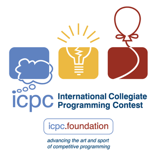



Except for the graduation year, Chinese universities will award scholarships to students based on their academic performance at the end of each academic year. When I was an undergraduate, I received first-class, second-class and third-class scholarships respectively in three years. When I was an undergraduate, I also participated in some computer-related or mathematics-related competitions, and the awards I won were as follows.

